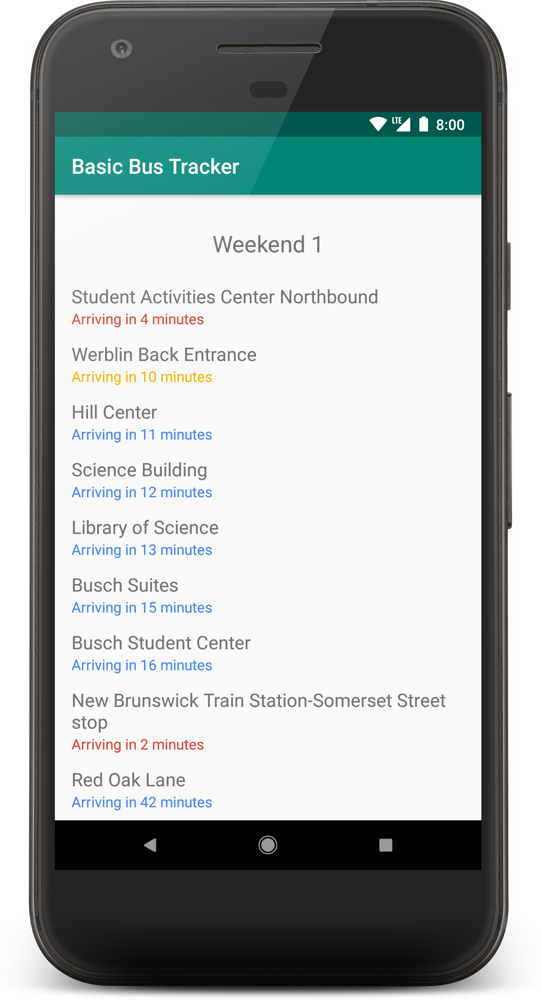

# Basic Bus Tracker

### Are you tired of those other Rutgers bus tracking apps with too many unnecessary features, like support for routes other than Winter Break 1?
What? No? You sure?

---
I made this over five days during January 2019 to get some more practice with [MVVM](https://en.wikipedia.org/wiki/Model%E2%80%93view%E2%80%93viewmodel) and Kotlin's [coroutines](https://kotlinlang.org/docs/reference/coroutines-overview.html).
## Features:
* Swipe to refresh!
* That's it.

<p align="center"></p>

## Dependencies
* [Gson](https://github.com/google/gson)
* [Retrofit](https://square.github.io/retrofit/)
* [kotlinx.coroutines](https://github.com/Kotlin/kotlinx.coroutines)
* [Kotlin Coroutine Adapter](https://github.com/JakeWharton/retrofit2-kotlin-coroutines-adapter)
* [ViewModel](https://developer.android.com/reference/android/arch/lifecycle/ViewModel), [ConstraintLayout](https://developer.android.com/reference/android/support/constraint/ConstraintLayout), etc.

## License
```
Copyright 2019 Miles Krell

Licensed under the Apache License, Version 2.0 (the "License");
you may not use this file except in compliance with the License.
You may obtain a copy of the License at

    http://www.apache.org/licenses/LICENSE-2.0

Unless required by applicable law or agreed to in writing, software
distributed under the License is distributed on an "AS IS" BASIS,
WITHOUT WARRANTIES OR CONDITIONS OF ANY KIND, either express or implied.
See the License for the specific language governing permissions and
limitations under the License.
```
